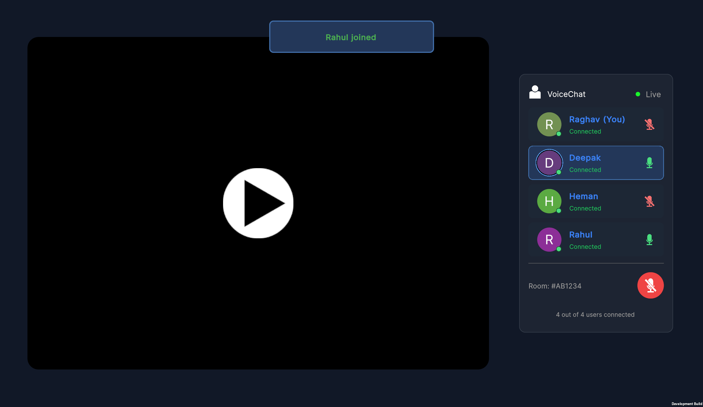

# Assignment for VR Unity Programmer Internship Application

A scalable, future-proof XR multiplayer project leveraging **Unity**, **Photon Fusion 2**, **Photon Voice**, and **UI Toolkit** (UXML & USS).  
Supports real-time player voice, dynamic UI, networked player management, and fully synchronized video with low latency and clear sound.

---

## Tech Stack

- **Unity (2022+)**  
  Industry-standard game engine for XR, AR, and VR content.

- **Photon Fusion 2**  
  Next-generation, high-performance networking framework supporting server-authoritative and client-hosted modes.
  - **Future-proof**: Built for high player counts, smooth state sync, and adaptable to upcoming XR requirements.

- **Photon Voice**  
  Real-time, low-latency voice chat solution for Unity multiplayer projects.
  - **Recorder settings**: Optimized for low latency and crystal-clear sound (see below).

- **Unity UI Toolkit**  
  Modern declarative UI system. All screens are authored in:
  - **UXML**: Markup for UI layouts (like HTML).
  - **USS**: Style sheets for UI styling (like CSS).

---

## Project Features

- **Dynamic Networked Player Management**
  - Player avatars, voice status, and all main logic are managed at runtime.
  - **Prefabs**:  
    - `PlayerPrefab`: Spawns dynamically in the MainScene to represent each user in the collaborative session, handles avatar, name, mic, and voice.
    - `Runner`: Responsible for starting the session, spawning players, and managing the `NetworkRunner` script.
  - There is almost **no static data**—all players, cards, and notifications are populated live as the session progresses.

- **Collaborative Session with Synchronized Video**
  - All users join a **single collaborative session** (not isolated XR sessions).
  - The MainScene includes a video player which is **fully synchronized**:  
    - If any user pauses the video, it pauses for everyone.
    - If any user plays/resumes, it plays for everyone in perfect sync.
    - This enables a true shared XR or collaborative viewing experience.

- **Low-Latency Voice Chat**
  - Uses **Photon Voice Recorder** with custom settings for minimal delay and optimal quality.
    - `Recording Enabled`, `Record When Joined`, `Transmit Enabled` ON
    - **Frame Duration**: 20ms  
    - **Sampling Rate**: 16000 Hz  
    - **Bitrate**: 60000  
    - **Input Source**: Microphone (Photon)  
    - Microphone fallback enabled  
  - These settings ensure the best balance between clarity and low delay for multiplayer/XR scenarios.

- **Modern UI/UX**
  - All UI is built with **UI Toolkit**, UXML layouts, and USS styles.
  - Player join/leave notifications, dynamic name plates, and voice/mic status indicators are all real-time and visually modern.

- **Scene-Based Architecture**
  - Modular code structure, with the majority of scripts attached to prefabs.
  - Players and their data are managed, spawned, and removed on-the-fly—no static arrays or lists.
  - Designed for scalability in XR and networked environments.

---

## Scenes

### Menu Scene

---

### Main Scene (Collaborative Session)

---

## Demo Video

  
Watch the full demo video here: [Demo Video Link](https://drive.google.com/file/d/1qOjnL0sWOMA8hdQ8bxMKQFder-aPfSF5/view?usp=sharing)

---

## Code/Architecture Highlights

- **Singleton Pattern**: Used for managers (e.g., `NetworkManager`, `UIManager`, `PlayerSpawner`) to keep references global and easy to access.
- **NetworkBehaviour and Prefabs**: All core scripts inherit from `NetworkBehaviour` and are meant to be attached to prefabs that Unity and Fusion instantiate as players join.
- **No Static Data**: All player items, avatars, notifications, and UI elements are generated dynamically at runtime based on the current network state.

---

## Why Photon Fusion 2?

- **Future-proof**: Supports large sessions, XR/VR features, and deterministic or state sync, making your project ready for evolving multiplayer and XR needs.
- **Smooth, Low-Latency Experience**: High-frequency state updates and efficient sync for physics, movement, and voice.

---

## Custom UI with UI Toolkit

- **UXML** is used for all layouts, providing a robust, modular way to design screens (like HTML but for Unity).
- **USS** is used for all visual styling, making it easy to keep UI modern and responsive (like CSS for Unity).
- All buttons, player cards, and status labels are easily modifiable via UXML and USS.

---

## Voice Chat Recorder Settings

- 
- Example settings for **Recorder** (Photon Voice) used for optimal voice quality in multiplayer XR:
  - **Recording Enabled**
  - **Record When Joined**
  - **Transmit Enabled**
  - **Frame Duration**: 20ms
  - **Sampling Rate**: 16000 Hz
  - **Bitrate**: 60000
  - **Microphone Type**: Photon (with fallback enabled)
  - All other options: default/off unless needed for your scenario

---

## Extending & Customization

- You can easily add more UI elements by expanding the UXML/USS files and caching them in `UIManager.cs`.
- Player prefab scripts (`MyPlayerAvatar`, `PlayerSpawner`, etc.) are ready for additional features like scoreboards, hand-raising, emoji, etc.
- Scene management and dynamic player spawning are handled with scalability in mind—add more features as needed without refactoring core flow.

---

## How To Use

1. **Clone or download the project.**
2. Open the project in Unity.
3. Set up your Photon App IDs for Fusion and Voice in Unity project settings.
4. Create a room or join a room, and experience real-time voice chat and modern UI.

---

*Built for future-proof multiplayer XR with clear voice, dynamic runtime UI, and scalable architecture.*

